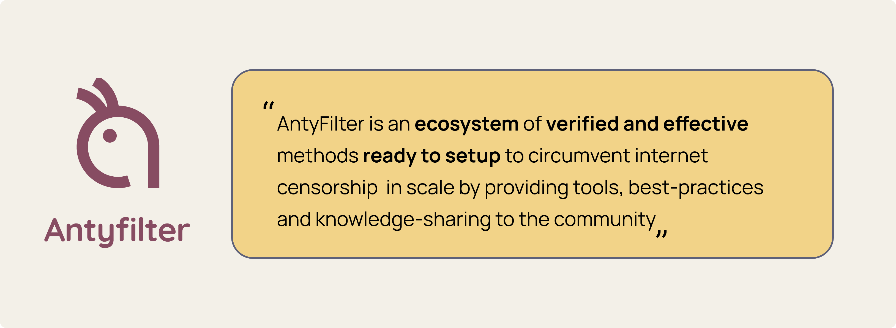

# AntyProxy

AntyProxy (by [Antyfilter](https://antyfilter.com/)) makes it easy to create effective VPN servers, giving anyone access to the open and free internet.



[Visit here for instruction in Persian | برای راهنمای نصب به فارسی به این صفحه مراجعه کنید](https://antyfilter.github.io/AntyProxy/setup-proxy-one-click.html)

## Overview

Using AntyProxy, you can setup a VPN server using several protocols with running only one script.

The servers currently included are:

- Telegram Proxy
- Shadowsocks + OBFS

_Protocols with CDN Support:_

- Shadowsocks + V2Ray
- VMESS
- DNS over HTTPS (DoH)
- Redirector

## Methods to install

There are two methods to install AntyProxy.

1. If you want to install it in any VPS server, use Method 1.
2. If you have credits on Microsoft Azure, you can use Method 2 to install AntyProxy with 1-click.

# Features

Moreover, after the setup is finished, you will enjoy the following features:

1. Special clash configuration that suits Iranian Internet Circumvention methods.
2. Your server will be hard to be detected. We recommend closing all ports except: `443, 80, 22`
3. Easy to use Installation guide will be available on your server. You can share this link to the users who need free internet access to follow the guide and connect to your server.

# Method 1 - Setup via script

You can install AntyProxy to your server using the following guide:

## Requirements

1. An `ubuntu 20.04`Server, bought from a VPS or a Cloud provider.
2. A domain name
3. A CDN provider, such as Cloudflare or ArvanCloud to connect your domain to your server's IP address.

If you need help with the above, create an Issue. We will update this tutorial with further guides.

## Main script

Make sure to change the `<secret>` and `<domain>` to your own values.

- `secret`: will be part of your server's tutorial URL. To generate a random secret, use this command in your terminal: `date | sha256sum | base64 | head -c 32; echo`
- `domain`: is your full domain name, and the subdomain (if you want to setup the VPN under a subdomain, e.g. `vpn.antyfilter.com`)

```bash
bash <(curl -sL https://raw.githubusercontent.com/Antyfilter/AntyProxy/main/install.sh) <secret> <domain> all <domain>
```

An example script would look like:
`bash <(curl -sL https://raw.githubusercontent.com/Antyfilter/AntyProxy/main/install.sh) ac7a17aadsddwd03e3ca8ad9673e055ee9 vpn.antyfilter.life all vpn.antyfilter.life`

# Method 2 - Setup via Deploy to Azure

### Telegram Proxy

<a href="https://portal.azure.com/#create/Microsoft.Template/uri/https%3A%2F%2Fraw.githubusercontent.com%2FAntyfilter%2FAntyProxy%2Fmain%2Ftelegram%2Ftelegram-vm-azure-template.json" target="_blank"></a>

### Shadowsocks Proxy

<a href="https://portal.azure.com/#create/Microsoft.Template/uri/https%3A%2F%2Fraw.githubusercontent.com%2FAntyfilter%2FAntyProxy%2Fmain%2Fshadowsocks%2Fss-azure-template.json" target="_blank"></a>

<!--
# Gost Proxy (deprecated)
<a href="https://portal.azure.com/#create/Microsoft.Template/uri/https%3A%2F%2Fraw.githubusercontent.com%2FAntyfilter%2FAntyProxy%2Fmain%2Fgost%2Fgost-vm-azure-template.json" target="_blank"></a> -->
